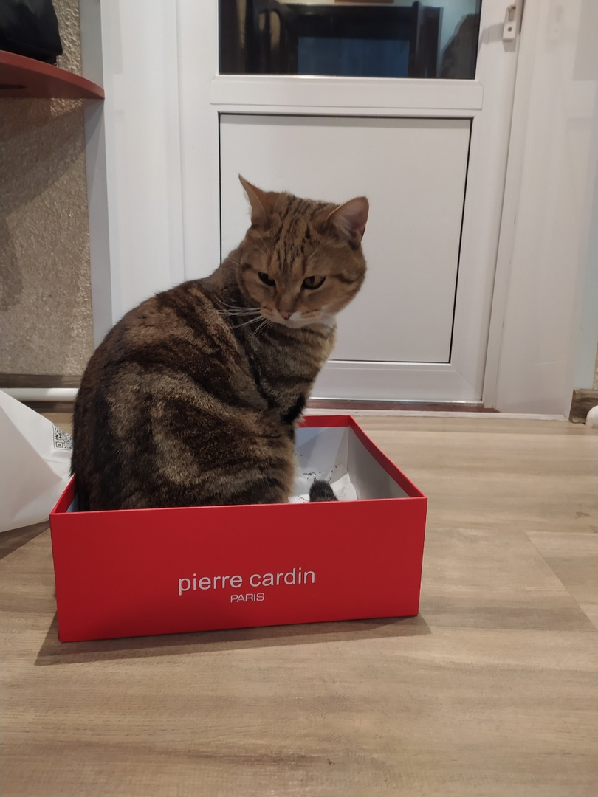
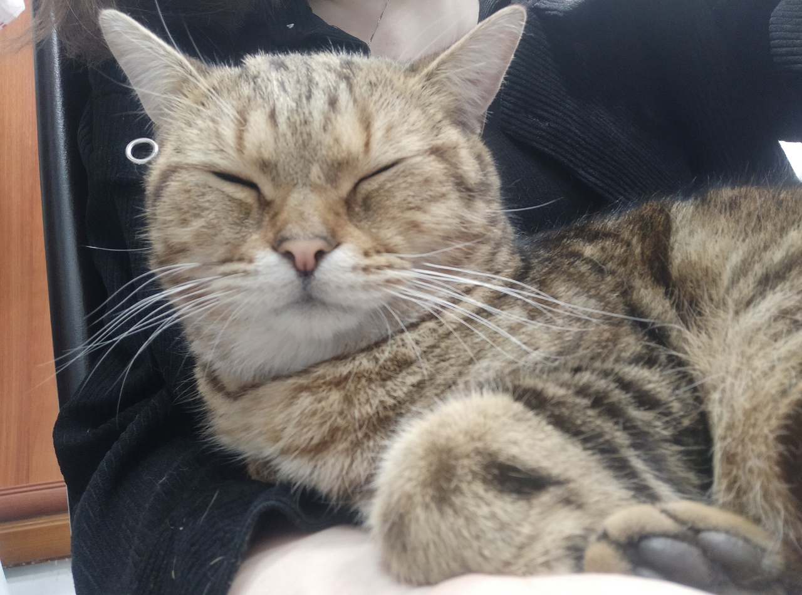

# Всем привет!
## Вы посетили страничку **татарочки** из Ульяновска, будущего фонтенд лида и просто _хорошего_ человека.

Итак: 
1. Меня зовут Регина Салихова, 25 лет. Живу в Ульяновске, родине Ленина!
2. По профессии я юрист, но мне захотелось стать программистом.
3. Сейчас усиленно учусь на курсе чтобы стать крутым специалистом Frontend разработки.
4. Уже изучила html, css, знаю основы программирования. Изучаю git.
5. Есть опыт создания как одностраничек, так и сайтов побольше работая в команде.
6. Стажировалась 3 месяца в прекрасной компании [Graphene](https://grphn.ru/)
7. Очень люблю котиков!

А это мой, кот Перси.

